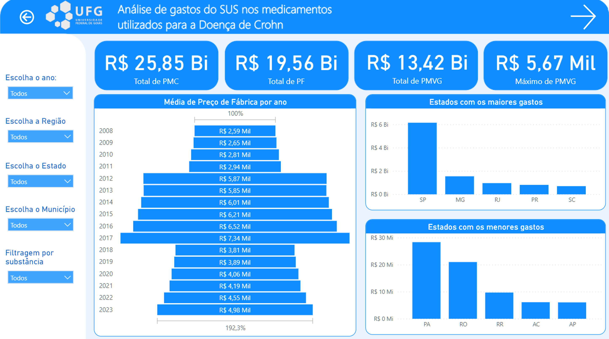
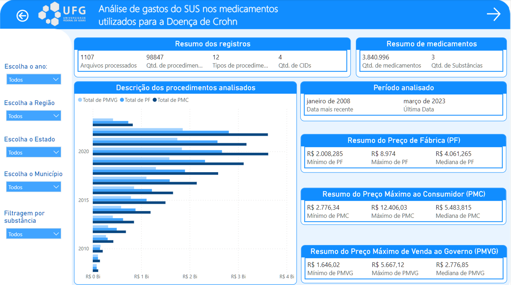
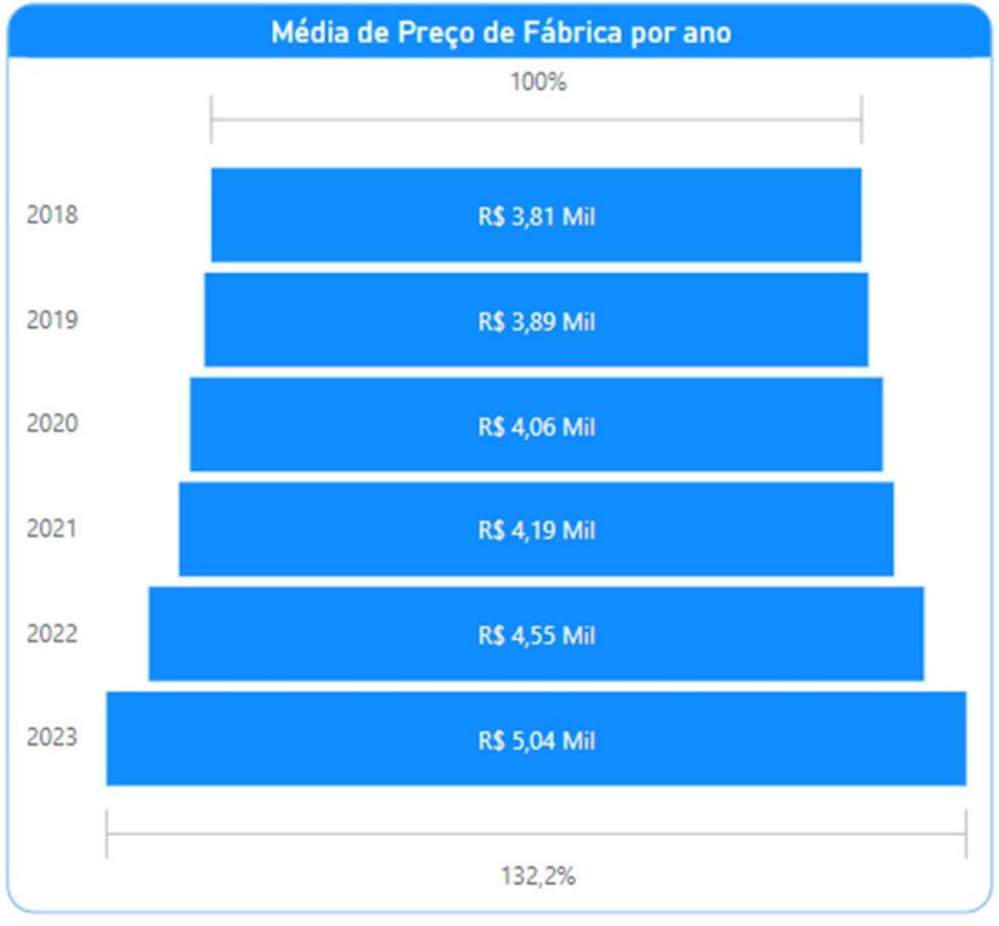
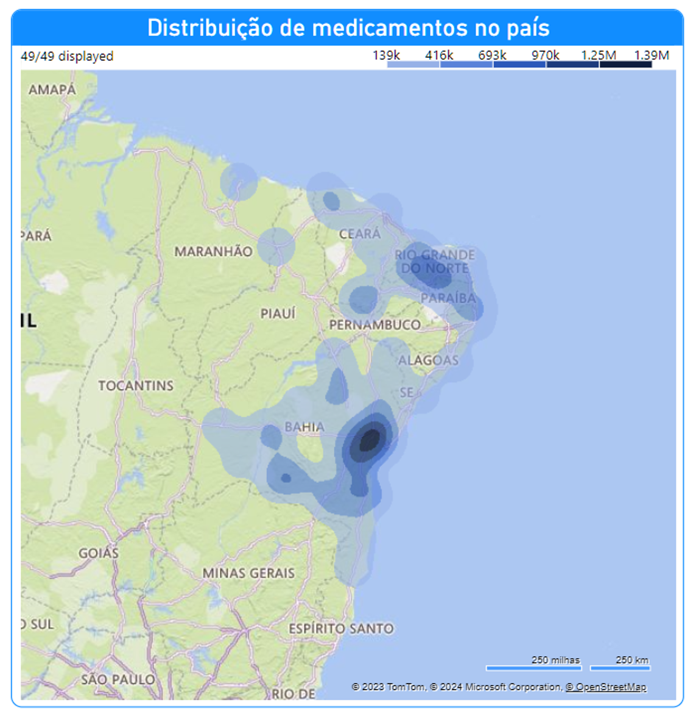
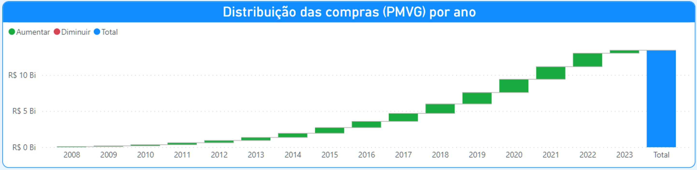

# 📊 Projeto de análise de dados do DATASUS 📊 

Esse dashboard foi desenvolvido no período de um ano (2024) com o intuito de analisar os dados de gastos do DATASUS com medicamentos de alto custo.

### 🎯 Objetivo do Projeto

Explorar os dados de demanda de medicamento para visualizar os gastos orçamentários e ajudar gestores da área da saúde a tomar melhores decisões.

Além disso, fazer um levantamento de dados através das bases públicas para analisar:

    O uso dos medicamentos;
    A distribuição;
    O custo ao governo.

### 🔍 Principais Descobertas
- O medicamento consegue ser bem distribuído na região Sul e Sudeste do país e menos distribuído na região Norte.

- O medicamento com a substância mais cara é o mais utilizado no país. 

- Durante os anos de 2020 e 2021, uma série de fatores influenciou os gastos e a distribuição de medicamentos, principalmente, a pandemia.

- Aumento de um maior raio de distribuição do medicamento entre 2008 e 2022.

### 📊 Análises

Nessa primeira tela, é possível ver uma visão geral dos dados de gastos, com os estados com mais gastos que ficam no sul e sudeste do Brasil e os estados com menos gastos que ficam focados no norte, mostrando uma discrepância em sua distribuição.

Na segunda imagem tem um outro ponto de vista da visão geral com algumas métricas dos arquivos analisados e do período. O gráfico principal tem três tipos de valores por ano, em que o azul escuro é o quanto o SUS gastaria se pagasse o valor que chega ao consumidor, o azul médio é o preço de fábrica, enquanto o mais claro é o preço que o governo realmente paga após o desconto que é feito para ele, já que ele disponibiliza de graça o tratamento.

O gráfico apresenta a evolução da média do preço de fábrica, por ano, de um medicamento específico incorporado em 2018. Observa-se uma tendência de crescimento contínuo no período de 2018 a 2023, com variação acumulada de 32,2% em relação ao valor inicial, passando de um índice base de 100% para 132,2%. Destaca-se que este medicamento não possui biossimilares e é o menos utilizado entre os outros analisados, o que indica que, mesmo com menor volume de uso, houve aumento relevante de preço ao longo dos anos. Essa variação deve ser considerada nas análises de impacto orçamentário e planejamento de aquisição.

Neste outro gráfico apresenta a distribuição do medicamento na região Nordeste, evidenciando diferenças relevantes entre os estados. A Bahia concentra o maior volume de distribuição, coerente com sua maior dimensão territorial e capacidade de cobertura assistencial. Em contraste, a Paraíba registra a menor média de unidades distribuídas, com 13,93 ampolas. Já o Piauí, embora tenha registros apenas na capital, Teresina, apresenta a maior média de quantidade distribuída, atingindo 63,88 ampolas, indicando concentração de fornecimento em um único polo. Entre as substâncias analisadas, o infliximab foi o medicamento mais utilizado na região.

O gráfico apresenta a evolução anual das compras com base na métrica de preço máximo cobrado ao governo, permitindo visualizar o comportamento dos gastos ao longo do tempo. Observa-se uma tendência geral de crescimento no período de 2008 a 2023, com aumentos graduais especialmente entre 2020 e 2021, porém em ritmo mais moderado, possivelmente influenciado pelo contexto da pandemia. O acumulado final evidencia expansão contínua, sem registros de valores negativos ou retrações anuais, indicando que não houve redução de gastos em nenhum dos anos analisados.

Acesse o dashboard completo [neste link](https://app.powerbi.com/view?r=eyJrIjoiYjVlZDRlZDEtYzY4Yi00YTRmLWEwNmItOTI4OWJhNDU4YTVlIiwidCI6IjI5NjM1NGU5LTk1MmItNDgwNC05NDE0LTA3N2MzZmVjNTg5NSJ9&pageName=ReportSection)

### 📊 Estrutura da base de dados

O modelo de dados foi construído no Power BI a partir de múltiplas fontes públicas. Ao todo, o modelo é composto por 13 tabelas.

- Base principal de dispensação/produção ambulatorial (DATASUS – SIA)

Essas tabela é responsáveis pelas métricas de:
- quantidade distribuída
- volume por estado/município
- demanda por medicamento

#### Tabelas de Preço
Foi incorporada tabela de referência de preços de medicamentos para estimativa de gastos, nela continha:
- PMVG — Preço Máximo de Venda ao Governo
- PF — Preço de Fábrica
- PMC — Preço Máximo ao Consumidor

Esses valores são utilizados para cálculo de gasto estimado, multiplicando o preço de referência pela quantidade distribuída.

### Tabela de municípios (IBGE)
Permitem análises por:
- estado
- região
- município
- recortes regionais (ex: Nordeste)

### Tabela de Procedimentos
- Base SIGTAP de procedimentos

Usada para padronizar e classificar os registros do SIA

### Modelagem

O modelo segue estrutura relacional com:
- chaves de ligação por código de procedimento
- códigos IBGE para localização
- chaves de medicamento/substância

Isso permite cruzar:
- demanda
- preço de referência
- localização
- período
- substância ativa